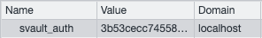

<div align="center">


<br>

# Authentication for SvelteKit

Svault is an authentication, authorization, and user management library for Svelte/SvelteKit applications. Svault supports both native username/password authentication as well as OAuth.


[🔐 Website](https://svault.dev) | [📚 Documentation](https://svault.mintlify.app) | [⌨️ Blog](https://medium.com/svault) | [💼 LinkedIn](https://www.linkedin.com/company/svault/)

</div>

<br>

## Features

- Svault is an open-source developer library that simplifies the authentication process in SvelteKit projects.
- Svault is flexible and lightweight, and allows the developer to decide which authentication types they would like to deploy in their application.
- With native username/password authentication, implementing registration and login functionality have never been easier. Cookies and sessions are automatically created and deleted upon logout or expiration.
- Svault also supports OAuth with a number of providers. Currently, it offers easy setup with Google, Github, and Discord, with more providers to come.
- Bonus: Svault provides premade component buttons for implementing OAuth!
- Currently, Svault's database adapter connects to the developer's PostgreSQL database, with additional database functionality in the works.

## Demo
***Gif or video here***

## Installation

1. Navigate to your SvelteKit project directory in the command line.
2. Run:
```bash
npm install svault
```


### Implementing OAuth in Your Application

1. When registering your application for OAuth set your callback url to match this format `/oauth/[provider]/validate`.

2. In the `src` directory of your project, create a `hooks.server.ts` file and paste the following code:
```TypeScript
// Import if you would like to use Oauth login (necessary for all Oauth)
import { SvaultOauth } from 'svault';


// Import if you would like to use Github Oauth
import { github } from 'svault';
import { GITHUB_CLIENT_ID, GITHUB_CLIENT_SECRET } from '$env/static/private';


// Import if you would like to use Google Oauth
import { google } from 'svault';
import { GOOGLE_CLIENT_ID, GOOGLE_CLIENT_SECRET } from '$env/static/private';
// Google callback urls have to match the callback url you setup in your development app so paste it here to pass into the Oauth function
const googleCallback = 'http://localhost:5173/oauth/google/validate';


// Import if you would like to use Discord Oauth
import { discord } from 'svault';
import { DISCORD_CLIENT_ID, DISCORD_CLIENT_SECRET } from "$env/static/private";
// Discord callback urls have to match the callback url you setup in your development app so paste it here to pass into the Oauth function
const discordCallback = 'http://localhost:5173/oauth/discord/validate';


// Set redirect path to your desired endpoint upon user login
const redirectPath = '/(yourPathHere)'; //ex. 'const redirectPath = '/redirectPage'


// Place the Oauth providers here
const providers = [
    github(GITHUB_CLIENT_ID, GITHUB_CLIENT_SECRET, redirectPath),
    google(GOOGLE_CLIENT_ID, GOOGLE_CLIENT_SECRET, redirectPath, googleCallback),
    discord(DISCORD_CLIENT_ID, DISCORD_CLIENT_SECRET, redirectPath, discordCallback)
];

// Svault Oauth handler
export const handle = SvaultOauth({ providers });
```
3. Create an `.env` file at the root level of your project and define your client ID and secret as variables. Example:
```TypeScript
// Paste if using Discord Oauth
DISCORD_CLIENT_ID = YOURIDHERE
DISCORD_CLIENT_SECRET = YOURSECRETHERE

// Paste if using Github Oauth
GITHUB_CLIENT_ID = YOURIDHERE
GITHUB_CLIENT_SECRET = YOURSECRETHERE

// Paste if using Google Oauth
GOOGLE_CLIENT_ID = YOURIDHERE
GOOGLE_CLIENT_SECRET = YOURSECRETHERE
```
4. In your `+page.svelte` file that has your login page, choose between the following options:

    a. Design your own OAuth button
    - Create a button or component for each provider you want to use, that will route to an endpoint of `/oauth/[provider-name-here]/auth`
    - Make sure to include an anchor tag within the button and/or component.
```TypeScript
// Example +page.svelte file for github authentication

<button>
    <a href="/oauth/github/auth">Github</a>
</button>

<button>
    <a href="/oauth/google/auth">Google</a>
</button>

<button>
    <a href="/oauth/discord/auth">Discord</a>
</button>
```

&nbsp;&nbsp;&nbsp;&nbsp;&nbsp;&nbsp;&nbsp;&nbsp;&nbsp;&nbsp;b. Optionally, import one of Svault's premade OAuth component buttons!

```TypeScript
// Example +page.svelte file for github authentication
  <script>
  import GithubButton from 'svault';
  import GoogleButton from 'svault';
  import DiscordButton from 'svault';
  </script>

  <GithubButton />
  <GoogleButton />
  <DiscordButton />
```
<div align="center">
The buttons will render as shown below:


</div>


5. And you're good to go!

*Note: OAuth providers are not set up to store any data in a database in this current iteration of Svault.*

<br>

### Implementing Native Authentication
1. In your `src` directory, create a `hooks.server.ts` file
```TypeScript
// Import if you would like to utilize native user registration and login
import { SvaultNative } from 'svault';


// Set redirect path to your desired endpoint upon user login
const redirectPath = '/[yourPathHere]'; //ex. 'const redirectPath = '/homepage'


// Svault native handler
export const handle = SvaultNative(redirectPath);
```
2. Create a PostgreSQL table with the following columns:
```SQL
CREATE_TABLE [YOURTABLENAME] (
    username VARCHAR NOT NULL,
    password VARCHAR NOT NULL,
)
```
3. In your `routes` directory, create a route called `login`. In your login `+page.svelte`, create form elements for taking in username and password inputs. Create buttons for login and register.
    - Ensure the endpoints are set to `registerValidate` and `loginValidate`
    - Create a separate button that is set to `logout` endpoint
```TypeScript
// Example routes/login/+page.svelte

<form method="post">
    <input
        type="text"
        placeholder="Username"
        name="username"
        required
    />
    <input
        type="password"
        placeholder="Password"
        name="password"
        required
    />

    <button type="submit" formaction="?/registerValidate">
        Register
    </button>
    <button type="submit" formaction="?/loginValidate">
        Login
    </button>
  </form>
```
```TypeScript
// To implement logout functionality, create a button or anchor tag in your page.svelte that redirects to '/logout'

<button>
    <a href="/logout">Logout</a>
</button>
```
3. In your `.env` file (create if you haven't done so) that takes in your database URI and user table name
```TypeScript
// Paste if using native authentication with a PostgreSQL database
PG_URI = YOURDATABASEURI
TABLE_NAME = YOURTABLENAME //ex. TABLE_NAME = users

//MAX_AGE will determine the expiration time of the user's session
MAX_AGE = Date.now() + {someNumberHere} * {someNumberHere}
// ex. Date.now() + 1000 * 60 * 60 --> session will last for 1 hour
```
4. After submitting the form, the user will be redirected to the endpoint of your choice.
    - Upon registering, the user will be added to the database with the username and a secure hashed password.
    - On login, the user will be authenticated through your database.
        - A browser cookie will be created as well as a session in local memory storage called "svault-auth".  
        <div align="center">
        
        </div>
        - The session will have an expiration time determined in your `.env` file.
        - Sessions will automatically be cleaned and deleted upon expiration.
    - On logout, the user will be redirected to the home page, the cookie will be deleted from the browser, and the session will be deleted from local memory store.
5. And you're good to go!

<br>


### Using Both Native Authentication and OAuth
1. To implement native authentication and OAuth, you can use SvelteKit's <a href=https://kit.svelte.dev/docs/modules#sveltejs-kit-hooks-sequence>Sequence</a> helper function.
2. In your existing `hooks.server.ts` file, add the following:
```TypeScript
import { sequence } from '@sveltejs/kit/hooks';
/*
NOTE: CANNOT HAVE 2 HANDLE FUNCTIONS!

export const handle = SvaultNative(redirectPath);
export const handle = SvaultOauth({ providers });
*/

// Rename functions to their corresponding type of authentication
export const native = SvaultNative(redirectPath);
export const oauth = SvaultOauth({ providers });

// Use sveltekit sequence method to run both hooks in sequence
export const handle = sequence(oauth, native);
```

<br>

### Serving Data Client-Side
- Svault automatically sends back authentication information to the frontend via the `event.locals` object. This allows you to display any necessary information you would like, client-side.
    - If you would like to display the user’s username on the page, simply load `event.locals.username` in your `+layout.server.ts`, and then call it on your `+page.svelte`.
    - If you would like to display an appropriate error message upon incorrect login, the error will be returned back to the client side on the `event.locals.failure` object.
- See example below:
```TypeScript
// In +layout.server.ts

import type { LayoutServerLoad } from '/$types';

export const load = (async ({ locals }) => {
  const { username, failure } = locals;
  return await { username, failure };
}) satisfies LayoutServerLoad;
```
```TypeScript
// In +page.svelte

<!-- displays username upon successful login -->
{#if data.username}
        <a
          href="/logout"
          data-sveltekit-reload
        >
            Hello {data.username}, Log out
        </a>
{:else}

<!-- displays error message if login is unsuccessful -->
		{#if data.failure}
			<div>
				{data.failure}
			</div>
		{/if}
```

<br>

## Roadmap
Svault is an amazing project with many areas for iteration. Here are some of the ideas to add and improve our features:
- Implement long term storage for OAuth users in the database
- Add more OAuth providers! (Facebook, Reddit, Twitter...)
- Change session cache to Redis rather than in-memory store
- Create a My Profile page that displays after a user has been authenticated
- Add additional DB adapters- MySQL, MongoDB, etc.
- Add access authorization and roles to different users
- Complete frontend sessions logic in browser
- Create testing suites
- Add UI components for login, making it a one-stop-shop
- Refactor the TypeScript code and define correct typings/interfaces


## How to Contribute
1. Fork this repo and clone from your forked repo onto your machine.
2. Create a new branch that details what feature is being developed.
3. Commit and push changes to your forked repository.
4. Submit a Pull Request from your forked remote branch into the Svault repo.


## The Svault Team
Franki Biswas <a href="https://github.com/fpena213">Github</a> | <a href="https://www.linkedin.com/in/franki-biswas/">LinkedIn</a>

Tristan Bott <a href="https://github.com/trisbt">Github</a> | <a href="https://www.linkedin.com/in/tristan-bott/">LinkedIn</a>

Michael Buenrostro <a href="https://github.com/mbuenrostro21">Github</a> | <a href="https://www.linkedin.com/in/michael-buenrostro/">LinkedIn</a>

Michelle Conroy <a href="https://github.com/missmshel">Github</a> | <a href="https://www.linkedin.com/in/michelleaconroy">LinkedIn</a>

Daniel Park <a href="https://github.com/parkdaniel731">Github</a> | <a href="https://www.linkedin.com/in/danielpark137/">LinkedIn</a>


## Credits
Inspired by <a href="https://lucia-auth.com/">Lucia</a> and <a href="https://authjs.dev/">Auth.js</a>, Svault expands the authentication tools available to Svelte/SvelteKit developers.


## License
Svault is developed under the <a href="https://github.com/oslabs-beta/Svault/blob/main/LICENSE">MIT license</a>.